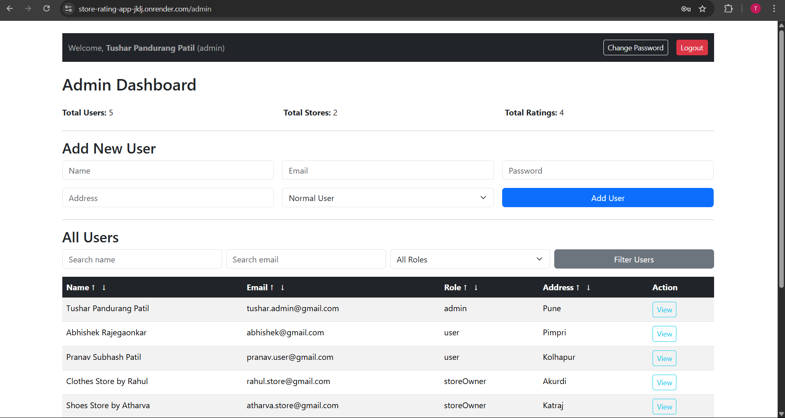
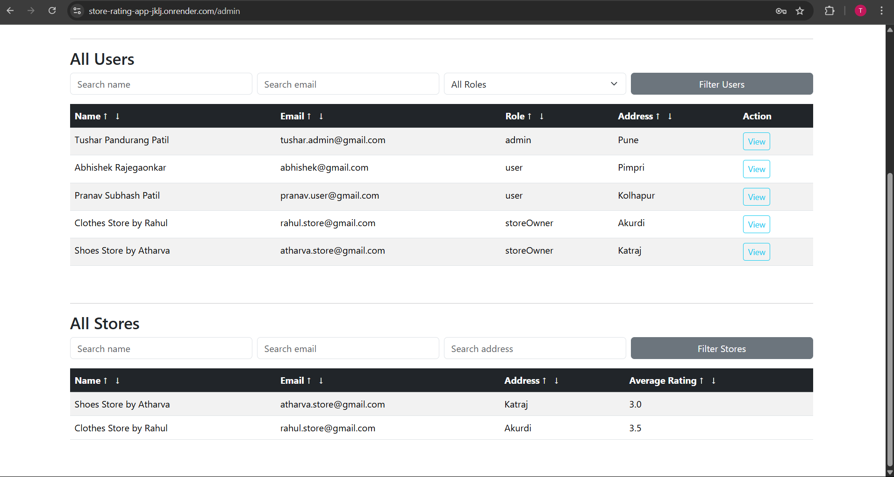
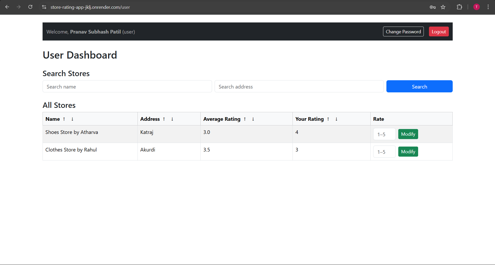
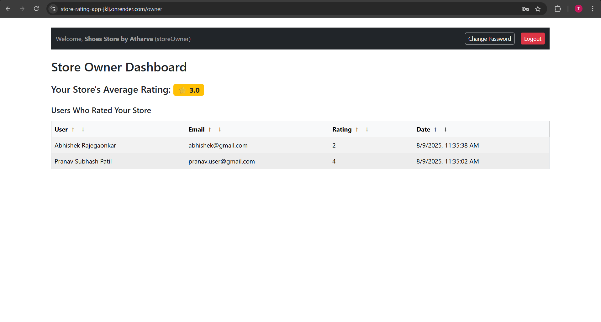

# Store Rating App - FullStack Web Application

A role-based store rating platform where users can discover, rate, and review stores. Features distinct dashboards for **System Administrators**, **Normal Users**, and **Store Owners**.

## Table of Contents
1. [Overview](#overview)
2. [Features](#features)
3. [Tech Stack](#tech-stack)
4. [Prerequisites](#prerequisites)
5. [Getting Started](#getting-started)
6. [Application Usage](#application-usage)
7. [Screenshots](#screenshots)
8. [Live Demo](#live-demo)
9. [License](#license)

---

## Overview
The Store Rating App enables:
- **Normal Users:** Sign up, browse stores, search, and submit/modify ratings (1–5).
- **Store Owners:** View ratings and statistics for their stores.
- **System Administrators:** Manage users, stores, and view platform statistics.

---

## Features

### General
- Role-based access control (Admin, User, Store Owner)
- JWT authentication
- Secure password update
- Search and sorting in tables
- Responsive UI with Bootstrap
- Toast notifications for user feedback

### System Administrator
- View dashboard statistics (total users, stores, ratings)
- Manage users and stores
- Filter and search functionality
- Assign stores to owners

### Normal User
- Browse and search stores
- Submit or modify store ratings
- View overall and personal ratings
- Update password

### Store Owner
- View users who rated their store
- See average rating
- Update password

---

## Tech Stack

### Frontend
- React.js
- React Router DOM
- Axios
- Bootstrap
- React Toastify

### Backend
- Node.js
- Express.js
- MySQL
- JWT for authentication
- bcryptjs for password hashing
- dotenv for environment variables
- CORS

---

## Prerequisites
- Node.js v18+
- npm v9+
- MySQL server

---

## Getting Started

### 1. Clone the Repository
```bash
git clone https://github.com/your-username/store-rating-app.git
cd store-rating-app
```

### 2. Install Dependencies
For **backend**:
```bash
cd backend
npm install
```
For **frontend**:
```bash
cd ../frontend
npm install
```

### 3. Environment Configuration
Create a `.env` file in the `backend` directory:
```plaintext
PORT=5000
DB_HOST=your_db_host
DB_USER=your_db_user
DB_PASSWORD=your_db_password
DB_NAME=your_db_name
JWT_SECRET=your_secret_key
CLIENT_URL=http://localhost:5173
```

Create a `.env` file in the `frontend` directory:
```plaintext
VITE_API_URL=http://localhost:5000/api
```

### 4. Running the Application
For **backend**:
```bash
cd backend
npm run start
```
For **frontend**:
```bash
cd frontend
npm run dev
```

---

## Application Usage & Functionalities

### 1. User Registration (Normal User)
- Fill in the registration form with:
  - **Name**
  - **Email**
  - **Password**
  - **Address**
- Password must be 8–16 characters, include at least 1 uppercase letter, and 1 special character.
- Role is set to **User** by default during registration.

### 2. User Login (All Roles)
- Enter email and password.
- Redirects based on user role:
  - **Admin** → `/admin`
  - **Normal User** → `/user`
  - **Store Owner** → `/owner`

### 3. System Administrator
- View platform statistics (total users, stores, ratings).
- Manage all users and stores.
- Assign stores to store owners.
- Filter and search users and stores.
- View and edit store details.

### 4. Normal User
- Browse and search for stores by name or address.
- Submit a rating (1–5) for any store.
- Modify an existing rating.
- View average rating and personal rating for each store.
- Update account password.

### 5. Store Owner
- View a list of users who rated their store.
- View the store's average rating.
- Update account password.

### 6. Profile Management (All Logged-in Users)
- Secure password update functionality with validation.

### 7. Logging Out
- JWT token is cleared from `localStorage` and session is ended.

---

## API Endpoints

**Authentication**
- `POST /api/auth/register` → Register a new user
- `POST /api/auth/login` → Login for all roles
- `PUT /api/auth/update-password` → Update password (requires authentication)

**Stores**
- `GET /api/stores` → Get all stores with optional search filters
- `POST /api/stores` → Create a store (Admin only)

**Ratings**
- `GET /api/ratings/store/:storeId` → Get store average and user rating
- `POST /api/ratings/:storeId` → Submit or modify a rating
- `GET /api/ratings/owner` → Get ratings for store owned by logged-in owner

**Admin**
- `GET /api/admin/stats` → Get admin dashboard statistics
- `GET /api/admin/users` → Get all users
- `GET /api/admin/stores` → Get all stores
- `PUT /api/admin/users/:id` → Update user details

---

## Form Validations
- **Name**: Required, max 60 characters
- **Address**: Required, max 400 characters
- **Password**: 8–16 characters, at least 1 uppercase letter, and 1 special character
- **Email**: Must be a valid email format
- **Rating**: Integer between 1 and 5

---

## Screenshots
*(Screenshots are stored in the `/screenshots` folder. Add them here in markdown format)*

Example:
  
  
  
  
  

---

## Live Demo
[Click here to view the deployed app](https://store-rating-app-jklj.onrender.com/)  

> **Note:** The app may take a little time to load on first access, as Render puts the service to sleep after inactivity.

---

## License
This project is licensed under the **MIT License**.